# Chef referral flow

This is the proposed end-to-end flow for chef referrals on Saveful Hero and
Legend mobile subscriptions. Hero and Legend are purchased through RevenueCat
and the App Store or Google Play; Stripe is not part of this flow.

## End-to-end flow

```mermaid
flowchart TD
  subgraph chefLane [Chef]
    chefProfile["EXISTING: Approved ChefProfile with a unique slug"]
    referralIdentity["NEW: One enabled referral token mapped to the chef"]
    shareAssets["NEW: Referral link, QR for the same link, and manual code"]
    chefProfile --> referralIdentity --> shareAssets
  end

  subgraph acquisitionLane [Referral acquisition]
    openReferral["Subscriber opens the link or scans the QR"]
    installed{"Saveful already installed?"}
    directOpen["Universal link opens Saveful with the referral token"]
    rememberToken["NEW: Deferred-link provider preserves the token"]
    installApp["Subscriber installs Saveful from the app store"]
    restoreToken["NEW: First app open restores the token"]
    manualCode["Subscriber enters the same token manually"]

    openReferral --> installed
    installed -->|"Yes"| directOpen
    installed -->|"No"| rememberToken --> installApp --> restoreToken
  end

  subgraph subscriberLane [Subscriber app and account]
    captureToken["Capture the referral token"]
    signedIn{"Subscriber signed in?"}
    otpSignup["EXISTING: OTP signup or login; NEW: keep token through auth"]
    referralReady["Referral is ready to bind to this account"]
    referralPaywall["NEW: Show Hero or Legend referral package with 5% off the first paid period"]
    mobilePurchase["EXISTING: Purchase through RevenueCat and the mobile store"]
    recurringPrice["Store charges the referral price once; later renewals use the standard price"]

    captureToken --> signedIn
    signedIn -->|"No"| otpSignup --> referralReady
    signedIn -->|"Yes"| referralReady
    referralPaywall --> mobilePurchase --> recurringPrice
  end

  subgraph backendLane [Saveful backend]
    validateToken["NEW: Resolve token and validate chef, status, self-referral, and subscriber eligibility"]
    validReferral{"Referral valid and eligible?"}
    normalFlow["Continue with the normal paywall; no referral discount or chef credit"]
    bindReferral["NEW: Bind and lock subscriber to chef before purchase"]
    revenueCatWebhook["EXISTING: POST /api/webhook/revenuecat updates subscription access"]
    claimTransaction["NEW: Claim event and store transaction idempotently"]
    duplicateEvent{"Transaction already processed?"}
    eventOutcome{"RevenueCat event outcome"}
    paidCheck{"Initial purchase or renewal with positive revenue and a bound referral?"}
    noCommission["Do not create commission; wait for a later eligible paid event"]
    financeFields{"Price, tax, and store commission fields available?"}
    reconciliationHold["Hold for finance reconciliation; do not estimate missing values"]
    calculateCommission["NEW: Net proceeds = price in purchase currency × 1 minus tax percentage minus store commission percentage; chef commission = 10% of net"]
    commissionLedger["NEW: Create a pending commission ledger row in minor units and transaction currency"]
    refundLookup["NEW: Find commission by original store transaction"]
    reverseCommission["NEW: Reverse pending earnings or create a negative balance adjustment if already paid"]
    stopFutureEarnings["Update subscription state; create no commission without another successful payment"]

    validateToken --> validReferral
    validReferral -->|"No"| normalFlow
    validReferral -->|"Yes"| bindReferral
    revenueCatWebhook --> claimTransaction --> duplicateEvent
    duplicateEvent -->|"Yes"| ignoredEvent["Ignore duplicate safely"]
    duplicateEvent -->|"No"| eventOutcome
    eventOutcome -->|"Initial purchase or renewal"| paidCheck
    paidCheck -->|"No, including a free trial"| noCommission
    paidCheck -->|"Yes"| financeFields
    financeFields -->|"No"| reconciliationHold
    financeFields -->|"Yes"| calculateCommission --> commissionLedger
    eventOutcome -->|"Refund or chargeback"| refundLookup --> reverseCommission
    eventOutcome -->|"Cancellation, expiry, or billing issue"| stopFutureEarnings
  end

  subgraph payoutLane [Admin, finance, and chef]
    payoutReview["NEW: Admin reviews payable chef balances"]
    payoutReady{"Payment details verified and payout approved?"}
    payoutHold["Hold balance and request or verify payment details"]
    sendPayout["NEW: Send payout and record provider reference"]
    paidLedger["NEW: Mark included ledger rows paid"]
    chefStatement["NEW: Chef sees aggregate referrals, earnings, reversals, and payout status"]

    payoutReview --> payoutReady
    payoutReady -->|"No"| payoutHold --> payoutReview
    payoutReady -->|"Yes"| sendPayout --> paidLedger --> chefStatement
  end

  shareAssets --> openReferral
  shareAssets --> manualCode --> captureToken
  directOpen --> captureToken
  restoreToken --> captureToken
  referralReady --> validateToken
  bindReferral --> referralPaywall
  recurringPrice --> revenueCatWebhook
  commissionLedger --> payoutReview
  reconciliationHold --> payoutReview
  reverseCommission --> payoutReview
```

## Confirmed commercial rules

- The subscriber receives **5% off the first paid billing period only**.
  Renewals are charged at the normal store price.
- The chef earns **10% of net proceeds** on the first positive paid
  transaction and every successful renewal attributed to that chef.
- Net proceeds are calculated per transaction and currency:
  `price_in_purchased_currency × (1 - tax_percentage - commission_percentage)`.
- Trials and other zero-price transactions create no commission. The first
  later transaction with positive revenue can create it.
- A refund or chargeback reverses the related commission. If that commission
  has already been paid, the reversal becomes a negative balance adjustment
  against a later payout.
- Cancellation, expiry, or a billing issue does not itself reverse valid
  earnings. It only stops new earnings until another successful payment occurs.
- Referral attribution is locked to the subscriber before purchase so changing
  links later cannot redirect historical or future renewal credit.

## Operational safeguards

- The QR contains the same universal referral URL that the chef can share; the
  visible code is a fallback for subscribers who cannot open the link.
- The subscriber must see the actual store-confirmed referral price before
  approving payment. The App Store or Google Play applies the discount, not the
  Saveful backend.
- Commission amounts are rounded and stored in integer minor units. Different
  currencies remain separate until finance defines a payout conversion policy.
- RevenueCat event IDs and store transaction IDs must be unique in the ledger.
  Retried or out-of-order webhooks must not create duplicate earnings.
- RevenueCat financial fields are estimates. Missing fields place an earning on
  hold, and payable balances should be reconciled against RevenueCat exports or
  store settlement reports before payment.
- Chef statements should be aggregate and must not expose subscriber personal
  information.

## Existing anchors and required additions

Existing code already provides:

- Chef identity, unique slugs, and payment-detail verification status in
  [`chef-profile.schema.ts`](../src/database/schemas/chef-profile.schema.ts).
- OTP signup with pending signup data in Redis in
  [`auth.service.ts`](../src/modules/auth/auth.service.ts).
- Direct in-app pending-link handling in
  [`pendingDeepLink.ts`](../../src/modules/deep_linking/pendingDeepLink.ts).
- RevenueCat subscription synchronization, webhook ordering, and event
  deduplication in
  [`subscription.service.ts`](../src/modules/subscription/subscription.service.ts).
- Current subscription state in
  [`subscription.schema.ts`](../src/database/schemas/subscription.schema.ts).

The referral program still requires:

- A referral-token and subscriber-attribution data model and APIs.
- A smart/deferred-link provider so attribution survives an app-store install.
- Signup and login changes that carry the referral token until it is bound.
- Store-specific Hero and Legend offers for the 5% first-period price, selected
  by the mobile paywall through RevenueCat.
- An idempotent transaction and commission ledger with reversal records.
- Admin balance review, payment-detail verification, payout recording, and an
  aggregate chef earnings view.
